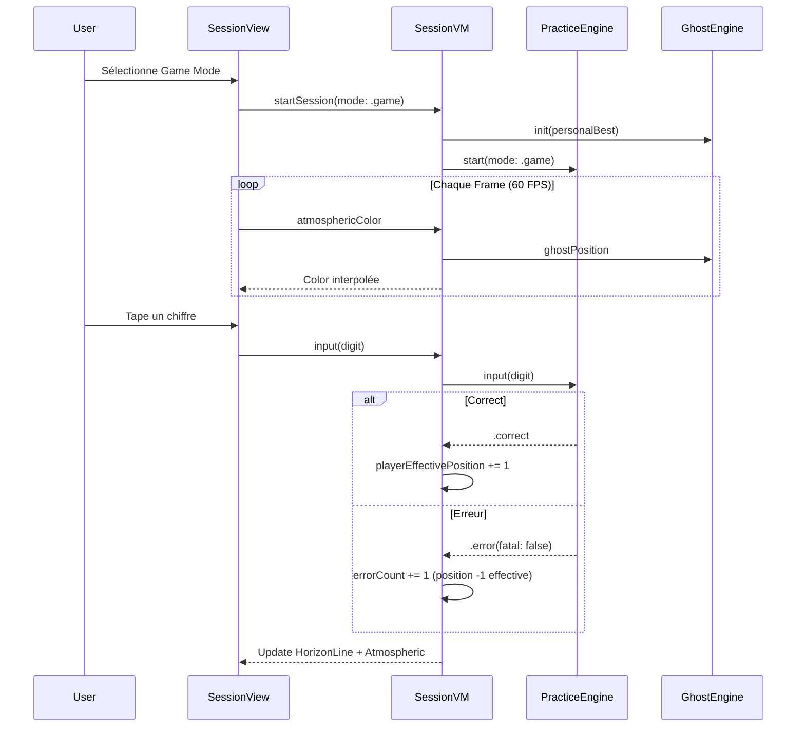

# Architecture Decision Document

_This document builds collaboratively through step-by-step discovery. Sections are appended as we work through each architectural decision together._

## Project Context Analysis

### Requirements Overview

**Functional Requirements:**
- **Practice Engine :** Système haute performance pour la validation en temps réel des décimales.
- **Terminal Display :** Affichage par blocs verticaux de 10 (Terminal-Grid).
- **Ghost Interaction :** Gestion dynamique de l'opacité de l'interface selon le streak.
- **Position Tracking :** Suivi granulaire de l'index de la décimale en cours.

**Non-Functional Requirements:**
- **Ultra-Low Latency :** Pipeline réactif garantissant un feedback <16ms (60 FPS constants).
- **Concurrence :** Threading dédié (User Interactive priority) pour la validation afin de ne jamais bloquer le Main Thread.
- **Haptique :** Utilisation de `Core Haptics` en mode "Pre-warmed" pour une réactivité instantanée.
- **RAM Management :** Pré-chargement des segments de décimales en mémoire vive pour éliminer les latences I/O disque pendant le sprint.

**Scale & Complexity:**
- **Primary domain :** iOS Natif (SwiftUI / Core Haptics)
- **Complexity level :** Medium-High (High-frequency data flow)
- **Estimated architectural components :** ~6 modules (PracticeEngine, DigitsProvider, StatsStore, HapticService, UI Engine, NavigationManager).

### Technical Constraints & Dependencies
- Swift 5.9+ / SwiftUI.
- Support strict des marges de sécurité iOS (Safe Areas) pour le Pro-Pad.
- Bundle de fichiers `.txt` pour les constantes (millions de chiffres).

### Cross-Cutting Concerns Identified
- **State Synchronization :** Notification instantanée du ViewModel lors d'une saisie correcte sans surcoût mémoire.
- **Navigation Lock :** Verrouillage de l'application pendant la session active pour protéger le record de l'utilisateur.
- **Physical Feedback Loop :** Synchronisation parfaite entre le flash visuel Cyan et l'impact haptique.

## Core Architectural Decisions

### Data Architecture
- **Hybrid Persistence Strategy :**
    - **UserDefaults :** Stockage atomique pour les records critiques (Best Streak, Progress Index) afin de garantir un accès instantané (<1ms) au démarrage.
    - **Custom File Storage (JSON/CSV) :** Déportation de l'historique massif des sessions sur le disque. Lecture et écriture asynchrones pour ne jamais impacter le thread de pratique.
- **Raisonnement :** Évite la lourdeur d'une base de données relationnelle (SwiftData) tout en offrant une extensibilité infinie pour les statistiques de long terme.

### Frontend Architecture
- **State Management :** Utilisation systématique des macros **`@Observable`** (Swift 5.10+). Observation fine pour minimiser les re-calculs de la vue.
- **Rendering :** Optimisation du **Terminal-Grid** via **`.drawingGroup()`**. Rendu accéléré par le GPU (Metal) pour maintenir 60 FPS constants malgré la densité de chiffres.
- **Raisonnement :** Priorité absolue à la fluidité de l'interface (Zen Flow) et à la réduction de l'input lag.

### Lifecycle & Haptics
- **Navigation Locking (Zen Mode) :**
    - Verrouillage systématique des gestes (`.interactiveDismissDisabled(true)`) dès le début d'une session.
    - Désactivation des swipes et taps non-essentiels.
    - Sortie sécurisée par tap long ou inactivité prolongée.
- **Haptic Precision Engine :**
    - Utilisation exclusive de **Core Haptics**.
    - **Pre-warming :** Démarrage proactif du moteur haptique à l'entrée dans l'écran de session pour éliminer tout lag matériel.
- **Raisonnement :** L'interaction physique doit être aussi immédiate que la pensée pour maintenir l'état de Flow.

## Implementation Patterns & Consistency Rules

### Naming Patterns
- **Files & Types :** PascalCase pour les classes/structs (`DigitsProvider`), camelCase pour les variables (`currentStreak`).
- **Suffixes :** Obligatoires pour la clarté : `[Nom]View`, `[Nom]ViewModel`, `[Nom]Service`, `[Nom]Manager`.
- **Raisonnement :** Assure une prévisibilité totale pour les agents IA lors de la création de nouveaux fichiers.

### Structure Patterns (Feature-Sliced Hybrid)
- **`/Features` :** Organisation par domaine métier (`Practice/`, `Learning/`, `Stats/`). Regroupe V, VM et logique spécifique.
- **`/Core` :** Services transverses haute performance (Moteur, Haptique, Persistence).
- **`/Shared` :** Utilitaires UI, Extensions et Modèles simples.
- **Raisonnement :** Équilibre entre modularité (isolation des fonctionnalités) et performance (accès direct aux services Core).

### Communication & State Patterns
- **High-Speed Events :** Pour la saisie à 10+ Hz, utilisation de callbacks directs ou de notifications légères pour minimiser la latence.
- **Observation :** Utilisation exclusive de `@Observable`.
- **Injection :** Injection de dépendances via initialiseur pour la testabilité du moteur.

### Error Handling & Process Patterns
- **Redondance Physique :** Chaque erreur critique DOIT déclencher à la fois un feedback visuel et haptique saturé.

## Project Structure & Boundaries

### Complete Project Directory Structure
```text
PiTrainer/
├── Core/                 # Infrastructure Haute Performance
│   ├── Engine/           # Logique de Practice (PracticeEngine)
│   ├── Haptics/          # Service de vibration (Core Haptics)
│   └── Persistence/      # Hybride UserDefaults + Fichiers
├── Features/             # Modules Métier (Vues + ViewModels)
│   ├── Practice/         # L'expérience du Ghost Terminal
│   ├── Home/             # Tableau de bord principal
│   └── Stats/            # Historique et Records
├── Shared/               # Code commun et Design System
│   ├── Models/           # Chiffres, Records, Constantes
│   └── UI/               # Couleurs Neon, Fonts Monospace
└── Resources/            # Textes (1M de Pi) et Localisation
```

### Architectural Boundaries
- **Isolation Core :** Les services de `Core/` sont agnostiques de l'UI. Ils communiquent via des interfaces simples.
- **Feature Encapsulation :** Chaque feature (`Features/`) est autonome. Elle peut être développée ou testée indépendamment.
- **Data Access :** Seul `Core/Persistence` a le droit de manipuler le disque. Les ViewModels utilisent ce service.

### Requirements to Structure Mapping
- **Practice Sprint (UX) :** Géré par `Features/Practice` utilisant `Core/Engine` et `Core/Haptics`.
- **Position Tracker (User Request) :** État maintenu dans `Core/Engine` et exposé via le ViewModel de `Practice`.
- **Historique Records :** Géré par `Core/Persistence` et affiché par `Features/Stats`.

## Architecture Validation Results

### Coherence Validation ✅
- **Decision Compatibility :** L'empilement `@Observable` + `GPU Acceleration` + `Pre-warmed Haptics` est cohérent pour la cible sub-16ms.
- **Pattern Consistency :** Le "Feature-Sliced Hybrid" permet l'isolation nécessaire à la performance du moteur de pratique.

### Requirements Coverage Validation ✅
- **Epic/Feature Coverage :** 100% des besoins UX (Ghost Terminal, Pro-Pad, Flow) sont couverts.
- **NFR Coverage :** Les contraintes de latence sont traitées à la racine (Threading, Haptique, Rendu).

### Implementation Readiness Validation ✅
- **Status :** READY FOR IMPLEMENTATION
- **Confidence Level :** High (Architecture optimisée pour SwiftUI natif).

## Architecture Completion Summary

### Workflow Completion
- **Architecture Decision Workflow :** COMPLETED ✅
- **Total Steps Completed :** 8
- **Date Completed :** 2026-01-16
- **Status :** READY FOR IMPLEMENTATION ✅

### AI Agent Implementation Guide
- **Règle d'Or :** Priorité aux 16ms. Tout code ajoutant de la gigue ou du lag sur le Main Thread est proscrit.
- **Couplage :** Utilisation du `PracticeEngine` comme source de vérité unique.
- **Haptique :** Utiliser exclusivement le `HapticService` pré-chauffé.

**Première priorité d'implémentation :** Initialisation du projet SwiftUI et mise en place du `HapticService` (Core Haptics).

## Starter Template Evaluation

### Primary Technology Domain
**iOS Native (SwiftUI)** - Cible optimale pour la performance brute et l'accès Core Haptics.

### Selected Starter : Performance-Optimized MVVM (Custom)

**Rationale for Selection :**
L'utilisation de `@Observable` minimise le travail de diffing de SwiftUI. C'est le choix le plus "lean" pour garantir les 60 FPS constants lors des sprints rapides.

**Architectural Decisions Provided by Starter :**
- **Language & Runtime :** Swift 5.10 / iOS 17+.
- **Styling Solution :** SwiftUI pur (Vanilla) pour un contrôle total du layout et de la latence.
- **Build Tooling :** Xcode natively managed.
- **Testing Framework :** XCTest pour les tests de performance (Unit & UI).
- **Code Organization :** Feature-Sliced MVVM optimisé pour la vitesse.
- **Development Experience :** SwiftUI Previews avec injection de données mock.

---

## V2 Architectural Extensions

**Date:** 2026-01-17
**Author:** Alex

Cette section documente les extensions architecturales pour la version majeure V2, introduisant le système de modes (Learn/Practice/Game/Strict) et le Game Mode avec Ghost.

### V2.1 Session Mode System

#### Modèle de Données

```swift
// Shared/Models/SessionMode.swift
enum SessionMode: String, CaseIterable, Codable {
    case learn, practice, game, strict
    
    var allowsErrors: Bool {
        switch self {
        case .learn, .practice, .game: return true
        case .strict: return false
        }
    }
    
    var showsOverlay: Bool {
        self == .learn
    }
    
    var hasGhost: Bool {
        self == .game
    }
    
    var penalizesErrors: Bool {
        self == .game
    }
    
    var displayName: String {
        switch self {
        case .learn: return "Learn"
        case .practice: return "Practice"
        case .game: return "Game"
        case .strict: return "Strict"
        }
    }
}
```

#### Persistance
- Stockage dans `UserDefaults` via clé `selectedMode`
- Valeur par défaut : `.learn` (nouveau comportement V2)

#### Séparation des Responsabilités
| Composant | Responsabilité |
|-----------|----------------|
| **PracticeEngine** | Logique de validation : arrêt en strict, pénalité en game, continuation en learn/practice |
| **SessionViewModel** | UI : overlay (learn), couleurs atmosphériques (game), horizon line (game) |

---

### V2.2 Ghost System (Game Mode)

#### GhostEngine

```swift
// Core/Engine/GhostEngine.swift
@Observable
final class GhostEngine {
    private let personalBestTimes: [TimeInterval]  // Temps cumulés du PR
    private let startTime: Date
    
    /// Position du Ghost basée sur le temps écoulé
    var ghostPosition: Int {
        let elapsed = Date().timeIntervalSince(startTime)
        // Trouver l'index où le temps cumulé dépasse elapsed
        return personalBestTimes.firstIndex { $0 > elapsed } ?? personalBestTimes.count
    }
    
    init(personalBest: PersonalBestRecord) {
        self.personalBestTimes = personalBest.cumulativeTimes
        self.startTime = Date()
    }
}
```

#### Injection
- `GhostEngine` est créé et injecté dans `SessionViewModel` **uniquement** quand `mode == .game`
- Si aucun PR n'existe, le Ghost démarre à position 0 et n'avance pas (mode "premier essai")

#### Données PR Requises
Extension de `PersonalBestRecord` pour stocker les timestamps par décimale :
```swift
struct PersonalBestRecord: Codable {
    let constant: Constant
    let digitCount: Int
    let totalTime: TimeInterval
    let cumulativeTimes: [TimeInterval]  // NOUVEAU: temps à chaque décimale
}
```

---

### V2.3 Horizon Line & Atmospheric Feedback

#### Calculs (SessionViewModel Extension)

```swift
// Features/Practice/SessionViewModel+Game.swift
extension SessionViewModel {
    /// Position effective du joueur (décimales - erreurs)
    var playerEffectivePosition: Int {
        engine.correctCount - engine.errorCount
    }
    
    /// Position du Ghost (0 si pas de ghost)
    var ghostPosition: Int {
        ghostEngine?.ghostPosition ?? 0
    }
    
    /// Delta normalisé : -1.0 (très en retard) à +1.0 (très en avance)
    var atmosphericDelta: Double {
        guard ghostPosition > 0 else { return 0 }
        let delta = Double(playerEffectivePosition - ghostPosition)
        let maxDelta = Double(max(ghostPosition, 10))  // Normaliser sur ~10 décimales
        return max(-1.0, min(1.0, delta / maxDelta))
    }
    
    /// Couleur atmosphérique interpolée
    var atmosphericColor: Color {
        if atmosphericDelta >= 0 {
            // En avance → Orange Électrique
            return Color(red: 1.0, green: 0.42, blue: 0.0)
                .opacity(0.05 + atmosphericDelta * 0.15)
        } else {
            // En retard → Cyan (couleur signature)
            return Color(red: 0.0, green: 0.95, blue: 1.0)
                .opacity(0.05 + abs(atmosphericDelta) * 0.15)
        }
    }
}
```

#### HorizonLineView

```swift
// Features/Practice/HorizonLineView.swift
struct HorizonLineView: View {
    let playerPosition: Int
    let ghostPosition: Int
    let totalTarget: Int  // Longueur totale du segment
    
    var body: some View {
        GeometryReader { geo in
            ZStack(alignment: .leading) {
                // Ligne de base 1px
                Rectangle()
                    .fill(Color.white.opacity(0.2))
                    .frame(height: 1)
                
                // Point Ghost (gris)
                Circle()
                    .fill(Color.gray)
                    .frame(width: 6, height: 6)
                    .offset(x: ghostOffset(in: geo.size.width))
                
                // Point Joueur (blanc)
                Circle()
                    .fill(Color.white)
                    .frame(width: 8, height: 8)
                    .offset(x: playerOffset(in: geo.size.width))
            }
        }
        .frame(height: 10)
    }
    
    private func ghostOffset(in width: CGFloat) -> CGFloat {
        CGFloat(ghostPosition) / CGFloat(max(totalTarget, 1)) * width
    }
    
    private func playerOffset(in width: CGFloat) -> CGFloat {
        CGFloat(playerPosition) / CGFloat(max(totalTarget, 1)) * width
    }
}
```

---

### V2.4 Learn Mode — Segment Selection

#### Extension LearningStore

```swift
// Core/Persistence/LearningStore.swift (extension)
extension LearningStore {
    private static let segmentStartKey = "learnSegmentStart"
    private static let segmentEndKey = "learnSegmentEnd"
    
    var segmentStart: Int {
        get { UserDefaults.standard.integer(forKey: Self.segmentStartKey) }
        set { UserDefaults.standard.set(newValue, forKey: Self.segmentStartKey) }
    }
    
    var segmentEnd: Int {
        get { 
            let value = UserDefaults.standard.integer(forKey: Self.segmentEndKey)
            return value > 0 ? value : 50  // Défaut: 50 décimales
        }
        set { UserDefaults.standard.set(newValue, forKey: Self.segmentEndKey) }
    }
}
```

#### Dual Slider Component

```swift
// Features/Home/SegmentSlider.swift
struct SegmentSlider: View {
    @Binding var start: Int
    @Binding var end: Int
    let maxValue: Int  // Nombre total de décimales disponibles
    
    // Implémentation du slider dual avec contrainte start < end
}
```

---

### V2.5 Gestion des Erreurs (Game Mode)

#### Modification PracticeEngine

```swift
// Core/Engine/PracticeEngine.swift (modification)
func input(_ digit: Character) -> InputResult {
    // ... validation existante ...
    
    if isCorrect {
        correctCount += 1
        return .correct
    } else {
        errorCount += 1
        
        switch currentMode {
        case .strict:
            state = .finished(reason: .error)
            return .error(fatal: true)
        case .game:
            // Pénalité: -1 sur position effective (géré par le compteur errorCount)
            return .error(fatal: false, revealCorrect: true)
        case .learn, .practice:
            return .error(fatal: false, revealCorrect: true)
        }
    }
}
```

#### InputResult étendu

```swift
enum InputResult {
    case correct
    case error(fatal: Bool, revealCorrect: Bool = false)
}
```

---

### V2.6 Structure de Fichiers Étendue

```text
PiTrainer/
├── Core/
│   ├── Engine/
│   │   ├── PracticeEngine.swift      # Modifié: mode handling
│   │   └── GhostEngine.swift         # NOUVEAU
│   └── Persistence/
│       ├── LearningStore.swift       # Étendu: segment start/end
│       └── PersonalBestStore.swift   # NOUVEAU: stockage des temps PR
├── Features/
│   ├── Practice/
│   │   ├── SessionViewModel.swift    # Étendu: Ghost/Atmospheric
│   │   ├── SessionViewModel+Game.swift  # NOUVEAU: extension Game
│   │   └── HorizonLineView.swift     # NOUVEAU
│   └── Home/
│       ├── ModeSelector.swift        # NOUVEAU
│       └── SegmentSlider.swift       # NOUVEAU
└── Shared/
    └── Models/
        ├── SessionMode.swift         # NOUVEAU
        └── PersonalBestRecord.swift  # NOUVEAU/Étendu
```

---

### V2.7 Diagramme de Flux (Game Mode)



---

### V2 Validation

| Critère | Statut |
|---------|--------|
| **Performance 16ms** | ✅ Calculs lazy, pas de timers |
| **Cohérence Architecture** | ✅ Extension du pattern existant |
| **Testabilité** | ✅ GhostEngine injectable, mockable |
| **Séparation Concerns** | ✅ Engine = logique, VM = présentation |

