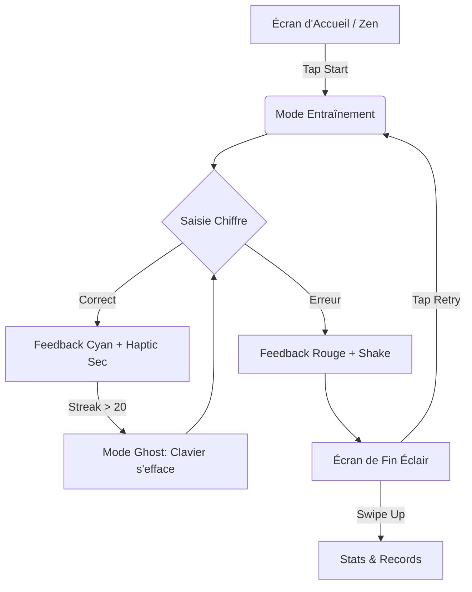
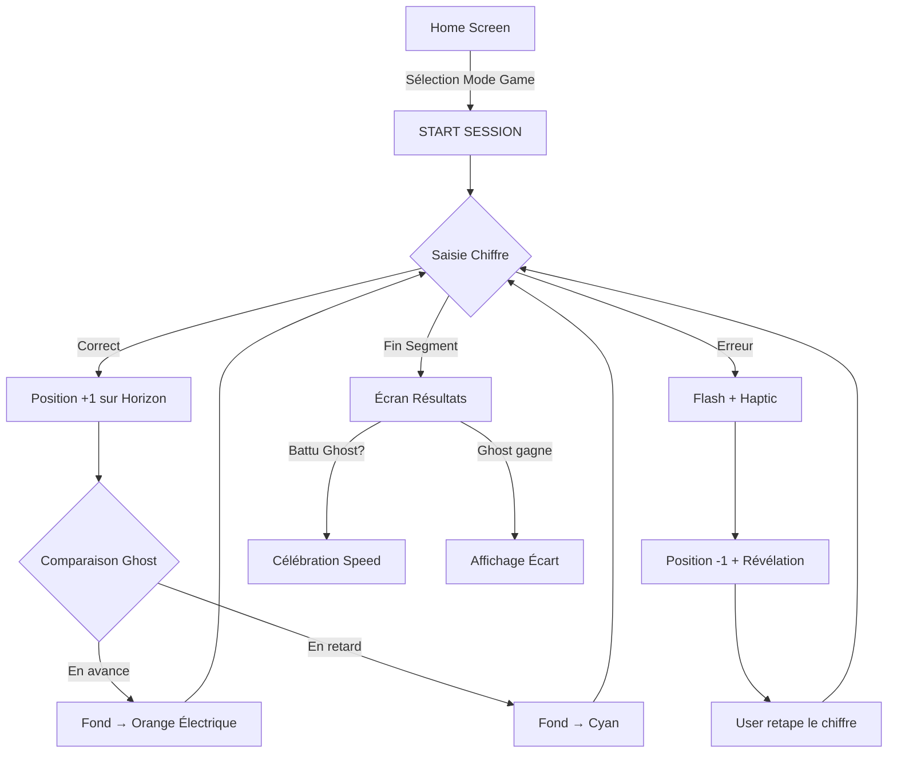
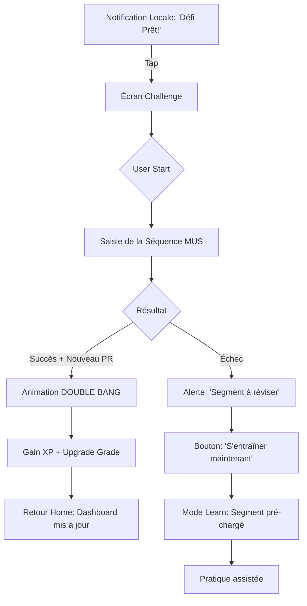

# UX Design Specification pi-trainer

**Author:** Alex
**Date:** 2026-01-15

---

<!-- UX design content will be appended sequentially through collaborative workflow steps -->

## Executive Summary

### Project Vision
Pi-Trainer est une application mobile iOS native conçue pour transformer la mémorisation des constantes mathématiques en un défi addictif. Le produit mise sur une interface ultra-minimaliste et performante, centrée sur le plaisir de la récitation rapide via le "Streak Flow".

### Target Users
Compétiteurs de mémoire, étudiants passionnés et utilisateurs technophiles cherchant un entraînement cognitif centré sur la performance et la répétition efficace.

### Key Design Challenges
- **Fluidité Prioritaire :** Garantir une latence de réponse <16ms, même pendant les pics d'animations.
- **Feedback Stimulant :** Créer un système de récompense visuelle qui encourage la vitesse sans obstruer la visibilité des chiffres.

### Design Opportunities
- **Système de "Tiered Flow" :** Le retour visuel s'intensifie par paliers (ex: x10, x20, x50 décimales sans erreur).
- **Haptique Rythmique :** Utiliser le Taptic Engine pour confirmer la précision du rythme de frappe.

## Core User Experience

### Defining Experience
L'expérience centrale est un état de "Flow" induit par la répétition rapide et précise. L'interface s'efface au profit de la récitation, ne réapparaissant que comme un système de feedback sensoriel (visuel et haptique) qui valide et encourage la performance.

### Platform Strategy
- **Native iOS :** Utilisation de SwiftUI avec optimisation du rendu via `drawingGroup` pour maintenir 60 FPS constants.
- **Haptic Engine :** Feedback physique distinct pour la validation (clic sec) et l'erreur (vibration double).
- **Zéro Latence :** Persistance locale immédiate via `UserDefaults`/`StatsStore`.

### Effortless Interactions
- **Focus Dynamique :** L'attention de l'utilisateur reste centrée sur le pavé numérique, avec une vision périphérique dédiée au streak.
- **Auto-Chunking :** Groupement visuel instantané des décimales par 10 pour faciliter la lecture/relecture.

### Critical Success Moments
- **PB Achievement :** Célébration subtile mais gratifiante lors du dépassement du record personnel.
- **Flow State Entry :** Activation douce des effets visuels après un streak de 10 décimales sans hésitation.

### Experience Principles
1. **Performance over Aesthetics :** Rien ne doit ralentir la saisie, même l'animation la plus belle.
2. **Sensory Reward :** Chaque réussite doit être "ressentie" physiquement (haptic) et visuellement.
3. **Frictionless Entry :** Lancer une session doit prendre moins de 3 secondes depuis l'ouverture de l'app.

## Desired Emotional Response

### Primary Emotional Goals
L'objectif est de placer l'utilisateur dans la peau d'un **athlète de la mémoire**. L'expérience doit générer de l'adrénaline par la vitesse, tout en récompensant la précision par un sentiment de maîtrise intellectuelle absolue.

### Emotional Journey Mapping
- **Lancement :** Concentration (Calme avant la tempête).
- **Session :** Adrénaline (Montée en puissance via le Streak Flow).
- **Échec :** Détermination (Effet "One more try" immédiat).
- **Succès (PB) :** Exaltation et Maîtrise (Validation de la performance).

### Micro-Emotions
- **Tension vs Flow :** Maintenir une légère excitation qui se transforme en fluidité totale lors des longs streaks.
- **Frustration Positive :** L'échec est un levier de motivation pour recommencer instantanément.

### Design Implications
- **Esthétique "Dark & Sharp" :** Mode sombre OLED profond, typographie technique (monospaced), contrastes élevés (Lime/Cyan électrique).
- **Audio de Tension (Heartbeat) :** Feedback sonore subtil de battement de cœur qui s'accélère à l'approche du record personnel (PB).
- **Haptique Évolutif :** Retour haptique qui devient plus sec et précis au fur et à mesure que le streak augmente.
- **Athlete Mode :** Option permettant de masquer tous les éléments non essentiels pour un tunnel de concentration pur (uniquement le chiffre en cours et le clavier).

### Emotional Design Principles
1. **Challenge-Driven :** Le design doit constamment inciter à dépasser ses limites.
2. **Resilient Failure :** L'échec est une étape d'apprentissage ; le bouton de redémarrage est prioritaire.
3. **Elite Aesthetic :** Un look pro et ultra-performant pour valoriser le sérieux de l'entraînement.

## UX Pattern Analysis & Inspiration

### Inspiring Products Analysis
- **Monkeytype (Performance Tool) :** Maîtrise du flow via une interface minimale. Pattern de feedback immédiat sur la précision et la vitesse (Digital Rain / Minimal Highlight).
- **Strava (Athletic Motivation) :** Gamification basée sur la performance pure et le dépassement de soi (Records Personnels/PB).
- **Rhythm Games (Sensory Immersion) :** Feedback crescendo basé sur le "streak" pour stimuler l'adrénaline.

### Transferable UX Patterns
- **Velocity Tracker :** Afficher discrètement un compteur de "Chiffres par seconde" pour stimuler la vitesse.
- **Progressive Feedback :** Le Streak Flow s'active par paliers de 10, 20, 50, devenant visuellement plus riche.
- **Instant Restart :** Un pattern "Echec -> Recommencement" sans friction (une seule action).

### Anti-Patterns to Avoid
- **Interstitial Overload :** Éviter les pop-ups ou écrans de transition longs entre deux sessions (tue le flow).
- **Gamification Enfantine :** Éviter les mascottes ou couleurs criardes qui nuiraient au côté "Pro / Athlète".

### Design Inspiration Strategy
- **Adopter :** Le minimalisme de Monkeytype pour l'écran de saisie.
- **Adapter :** Le système de records de Strava pour les statistiques de mémorisation.
- **Éviter :** Toute animation qui ralentirait la perception de la saisie (latence visuelle).

## Design System Foundation

### 1.1 Design System Choice
**Système Hybride Custom (Native-Powered)**. Nous utiliserons SwiftUI comme moteur de rendu pur, sans bibliothèque de composants tierce, pour garantir une performance maximale.

### Rationale for Selection
- **Performance :** L'utilisation de composants SwiftUI natifs garantit la fluidité (<16ms) demandée par Amelia.
- **Identité :** Une interface sur mesure est nécessaire pour créer le sentiment d'utiliser un "instrument de précision" plutôt qu'une application classique.
- **Maintenabilité :** Pas de dépendance externe, ce qui assure la pérennité du projet.

### Implementation Approach
- **Tokens :** Palette de couleurs technique, échelle typographique optimisée pour la lecture de chiffres.
- **Composants :** Développement d'un pavé numérique spécifique ("Pro-Pad") et d'un système de rendu de texte optimisé pour les longs streaks.

### Customization Strategy
- Focus sur le **Dark Mode** comme expérience par défaut.
- Typographie **Monospaced** pour les alignements parfaits.
- Utilisation des **SF Symbols** retravaillés pour une esthétique technique.

## 2. Core User Experience

### 2.1 Defining Experience : The Streak Flow
L'expérience centrale est le "Streak Flow", une interaction fluide où la saisie des décimales déclenche une progression sensorielle (visuelle et haptique). Ce n'est plus une récitation, c'est une performance rythmique.

### 2.2 User Mental Model
L'utilisateur perçoit les constantes comme des mélodies numériques découpées en mesures de 10 chiffres. Le design doit supporter cette segmentation mentale sans briser la continuité de la frappe.

### 2.3 Success Criteria
- **Instant Reponse :** <16ms de latence perçue.
- **Rhythmic Feedback :** La sensation physique de la frappe doit aider à maintenir la cadence.
- **Visual Gratification :** L'intensité visuelle doit être proportionnelle au mérite (longueur du streak).

### 2.4 Novel UX Patterns
- **The "Athlete Mode" Toggle :** Un pattern de réduction d'interface poussé à l'extrême pour le focus.
- **Gradual Haptic :** Un retour haptique dont l'intensité ou la texture évolue dynamiquement.

### 2.5 Experience Mechanics
- **Init :** Première saisie = Départ automatique.
- **Loop :** Saisie -> Validation -> Feedback Visuel/Haptic -> Incrémentation Score/Streak.
- **Fail :** Haptique d'erreur -> Freeze visuel -> Affichage de la solution correcte -> Replay prompt.

## Visual Design Foundation

### Color System (Dark & Sharp)
- **Background :** Noir OLED (`#000000`) pour une immersion totale et zéro distraction.
- **Accent Primary :** Cyan Électrique (`#00F2FF`) utilisé avec parcimonie pour le chiffre actif et les moments de flow.
- **Negative Space :** Utilisation massive du vide pour diriger l'attention.
- **Semantic Mapping :** Blanc pur pour la validité, Cyan pour le flow, Rouge profond pour l'erreur fatale.

### Typography System (Technical Monospace)
- **Primary Typeface :** SF Mono (ou JetBrains Mono) pour tous les chiffres. La chasse fixe est cruciale pour la prévisibilité visuelle des blocs de 10.
- **Secondary Typeface :** SF Pro pour les métadonnées (CPS, Streak) en petite taille (Captions).
- **Hierarchy :** Fokus massif sur le chiffre central, métadonnées désaturées en périphérie.

### Spacing & Layout Foundation (Zen-Athlete)
- **Density :** Ultra-épurée. Suppression de tout "chrome" (bordures, conteneurs, ombres).
- **Core Layout :** Un axe central vertical pour les chiffres, clavier borderless en bas.
- **Safe Areas :** Respect strict des marges iOS pour une utilisation confortable à une ou deux mains.

### Accessibility Considerations
- **High Contrast :** Respect des ratios WCAG pour le texte blanc/cyan sur fond noir.
- **Dynamic Type :** Support des tailles de police système tout en préservant l'alignement monospace.
- **Reduced Motion :** Option pour désactiver les auras de flow pour les utilisateurs sensibles.

## Design Direction Decision

### Design Directions Explored
Nous avons exploré 4 directions basées sur le minimalisme extrême (**Zen-Athlete**) :
1. **The Ghost (D1) :** Clavier invisible/fantôme, focus horizontal.
2. **Pure Focus (D2) :** Chiffre unique au centre.
3. **Terminal Flow (D3) :** Blocs verticaux techniques (Monkeytype style).
4. **Data Block (D4) :** Grille dense (Matrix style).

### Chosen Direction : The Hybrid Ghost Terminal
L'approche finale est une fusion de **D1** et **D3**.
- **Structure (D3) :** Affichage par blocs verticaux de 10 chiffres (comme un terminal de code).
- **Interaction (D1) :** Pavé numérique "fantôme" qui s'efface au profit de la zone de saisie.

### Design Rationale
- **Lisibilité :** Le découpage vertical par 10 (Terminal) respecte parfaitement le modèle mental de segmentation des constantes.
- **Concentration :** Le retrait du clavier visuel (Ghost) force l'utilisateur à se fier à sa mémoire musculaire, renforçant l'identité d'athlète.
- **Esthétique :** Un look pro, technique et épuré qui évite tout aspect "jouet".

### Implementation Approach
- Utilisation de colonnes SwiftUI avec `Text` monospaced.
- Le clavier sera rendu avec une opacité très faible (5-10%) ou uniquement via un feedback haptique au toucher.
- Le focus se déplace verticalement par bloc de 10, créant un rythme de "scan" efficace.

## User Journey Flows

### 1. Le "Sprint Immersif" (Le coeur du produit)
Parcours de pratique pure où le **Ghost Terminal** prend tout son sens.
- **Entrée :** Tap sur "START" ou sur le premier chiffre.
- **Action :** Saisie ultra-rapide par blocs de 10. Le clavier s'estompe progressivement.
- **Pivot Flow :** À 20 chiffres sans faute, l'interface passe en mode "Focus Néon" (désactivation de tout élément périphérique).
- **Sortie :** Erreur ou Fin de bloc décidée par l'utilisateur.

### 2. Le "Restart Instantané" (Effet "One More Try")
Pour maintenir l'adrénaline, l'échec est une opportunité de rebond immédiat.
- **Trigger :** Saisie d'un chiffre incorrect.
- **Feedback :** Shake discret de l'écran + mise en évidence rouge de l'erreur.
- **Action :** Bouton de redémarrage prioritaire permettant de relancer une session en <500ms.

### 3. Consultation des Records
- **Action :** Accès rapide aux statistiques CPS et Streaks depuis l'écran de fin.
- **Visualisation :** Graphiques épurés montrant la progression de la "vitesse d'athlète".

### Journey Diagram

```mermaid
graph TD
    A[Écran d'Accueil / Zen] -->|Tap Start| B(Mode Entraînement)
    B --> C{Saisie Chiffre}
    C -->|Correct| D[Feedback Cyan + Haptic Sec]
    D -->|Streak > 20| E[Mode Ghost: Clavier s'efface]
    E --> C
    C -->|Erreur| F[Feedback Rouge + Shake]
    F --> G[Écran de Fin Éclair]
    G -->|Tap Retry| B
    G -->|Swipe Up| H[Stats & Records]
```

### Flow Optimization Principles
1. **Zero Intermediate Screens :** Aucun écran de chargement entre l'accueil et la session.
2. **Haptic Sync :** Chaque étape de la journey est confirmée par une signature haptique unique.
3. **Immersive Persistence :** Le mode "Zen" persiste tant que l'utilisateur n'a pas consciemment quitté la session.

## Component Strategy

### Design System Components
Nous utilisons les fondations de **SwiftUI** sans bibliothèque externe pour préserver une latence <16ms. Les composants standards (List, Button) seront stylisés via des `Style` personnalisés pour correspondre à l'esthétique Zen-Athlete.

### Custom Components

#### 1. Le "Terminal-Grid" (Affichage des chiffres)
- **Purpose :** Affichage vertical rythmé par blocs de 10.
- **Anatomy :** Texte Monospaced, indicateur de ligne (ex: `150 >`) pour le repérage spatial.
- **Behavior :** Défilement fluide vers le haut à mesure que les lignes sont complétées.

#### 2. Le "Pro-Pad" (Le Pavé Numérique "Ghost")
- **Purpose :** Saisie sans friction visuelle.
- **Interaction :** Opacité dynamique de 20% (repos) à 5% (flow intense). 
- **Feedback :** Chaque touche déclenche un micro-flash Cyan et un retour haptique sec.

#### 3. Le "Flow-O-Meter" (Tableau de bord de performance)
- **Purpose :** Monitoring en temps réel de la performance.
- **Content :** 
    - **Position Tracker :** Affichage de l'index de la décimale en cours (ex: `#156`). La valeur s'incrémente instantanément à chaque saisie correcte.
    - **CPS :** Vitesse de frappe actuelle.
    - **Streak :** Compteur de succès consécutifs.
- **Visual :** Typographie technique désaturée, s'intègre en haut de l'écran sans créer de "barre" visuelle.

### Component Implementation Strategy
- **Zéro Dépendance :** Tous les composants sont des `View` SwiftUI pure.
- **Atomic Design :** Création d'un `DigitView` atomique gérant ses propres états d'animation (active, error, ghost).
- **Haptic Engine Service :** Un service centralisé pour déclencher les signatures haptiques selon le composant.

### Implementation Roadmap
- **Phase 1 (Core Engine) :** Terminal-Grid + Pro-Pad basique.
- **Phase 2 (Experience) :** Flow-O-Meter avec incrémentation en temps réel et Position Tracker.
- **Phase 3 (Polissage) :** Opacité dynamique (Ghost Mode) et animations de transition Flow.

## UX Consistency Patterns

### Feedback Patterns
- **Standard Success :** Chaque saisie correcte déclenche un feedback haptique discret (16ms) et un éclat visuel Cyan éphémère.
- **Aggressive Failure :** L'erreur déclenche un "Shake" horizontal de la ligne en cours, une vibration double, et affiche immédiatement la solution correcte pour minimiser la frustration.

### Navigation Patterns (Invisible Navigation)
- **Navigation Lock :** Une fois la session lancée, tous les gestes de navigation (suipes) sont verrouillés pour éviter toute interruption accidentelle.
- **Contextual Discovery :** Des "hints" visuels subtils (flèches estompées) guident les premiers gestes (Swipe Up pour les records) lors de la phase d'onboarding.
- **Exit Trigger :** Le bouton "Quit" n'apparaît qu'en cas d'inactivité prolongée (>3s) ou après une erreur.

### Button Hierarchy
- **Action Pivot (Retry) :** Un bouton massif occupe l'espace central après un échec, incitant au redémarrage immédiat.
- **Secondary Actions :** Les réglages de constante ou d'affichage sont relégués à des taps longs ou des swipes depuis l'accueil, préservant la pureté de l'interface principale.

### Empty States
- **Onboarding Zen :** En l'absence de records, l'application affiche un message invitant au premier sprint : *"Prêt à devenir un athlète de la mémoire ?"*.

## Responsive Design & Accessibility

### Responsive Strategy
- **Mobile-First (Performance) :** Optimisation pour la latence et l'utilisation à une main sur iPhone. L'expérience est taillée pour des sessions courtes et intenses en mobilité.
- **iPad Support :** Layout étendu permettant de voir jusqu'à 100 décimales simultanément (vision panoramique) tout en conservant le Terminal-Grid.
- **Orientation :** Verrouillage en mode Portrait pour la saisie active (optimisation ergonomie clavier).

### Accessibility Strategy
- **Visual :** Thème high-contrast par défaut (OLED Black / Cyan). Support du Dynamic Type pour l'interface de statistiques et d'onboarding.
- **Motion :** Toggle "Zen-Mode Plus" pour supprimer toutes les animations non indispensables (reduction of motion).
- **Haptic :** Feedback physique redondant pour chaque action critique (Saisie/Erreur) pour les utilisateurs ayant des troubles de l'attention ou de la vision.
- **VoiceOver :** Chaque bloc de 10 sera annoncé comme une unité logique lors de la relecture.

### Testing Strategy
- Validation sur VoiceOver pour le flux de saisie active.
- Tests d'ergonomie "One-Hand" sur les différents formats d'iPhone.
- Vérification du contraste WCAG sur les zones d'opacité du Ghost Mode.

---

## V2 Feature Extensions

**Date:** 2026-01-17
**Author:** Alex

Cette section documente les extensions UX pour la version majeure V2, introduisant la structure tripolaire Learn/Practice/Play et le Game Mode avec Ghost.

### V2.1 Navigation "Dual Selector"

#### Pattern
L'écran d'accueil adopte un pattern **Dual Selector** avec deux rangées de sélection :

```
┌─────────────────────────────────────┐
│                                     │
│       [π]  [e]  [φ]  [√2]          │  ← Constant Selector (existant)
│                                     │
│   [Learn] [Practice] [Game] [Strict]│  ← Mode Selector (NOUVEAU)
│                                     │
│          [ START SESSION ]          │  ← CTA Principal
│                                     │
│   🏆        📊        ⚙️            │  ← Bottom Bar
│ Challenges  Records   Réglages      │
└─────────────────────────────────────┘
```

#### Décisions
| Aspect | Décision |
|--------|----------|
| **Style Mode Selector** | Identique au Constant Selector (pills/chips horizontaux) |
| **Modes Disponibles** | Learn, Practice, Game, Strict |
| **Mode par Défaut** | **Learn** (nouveau mode d'apprentissage) |
| **Persistance** | Oui — le dernier mode utilisé est mémorisé |

#### Bottom Bar Étendue
- **Challenges** (à gauche) — Phase 2
- **Records** (centre) — Existant
- **Réglages** (droite) — Existant, simplifié (mode retiré car dans Home)

---

### V2.2 Mode Learn (Apprentissage Guidé)

#### Concept
Le Mode Learn est conçu pour l'apprentissage par répétition avec guidage visuel permanent. L'utilisateur tape les chiffres par-dessus un calque transparent affichant les décimales cibles.

#### Décisions
| Aspect | Décision |
|--------|----------|
| **Affichage Guide** | Comme le mode "Révélé" actuel (icône œil) — Bloc complet visible |
| **Feedback Validation** | Identique au mode Practice — Cohérence inter-modes |
| **Sélection Segment** | **Dual Slider** (début/fin) pour choisir le segment à apprendre |

#### Principe Clé
> L'utilisateur doit se sentir "chez lui" — UI cohérente entre Learn, Practice, Game, Strict.

Le **Mode Learn** = Mode Practice **avec overlay forcé** (œil activé par défaut) + **segment personnalisable** (dual slider).

---

### V2.3 Mode Game (Ghost + Horizon Line)

#### Concept
Le Mode Game introduit une course contre soi-même matérialisée par un "Ghost" représentant le Personal Best (PR) de l'utilisateur. Une ligne d'horizon visualise la progression relative.

#### Horizon Line
| Aspect | Décision |
|--------|----------|
| **Position** | Au-dessus du Terminal Grid (sous les métadonnées) |
| **Représentation** | Barre minimaliste 1px |
| **Points** | **Blanc** (joueur) + **Gris** (Ghost) |

#### Atmospheric Feedback
| Aspect | Décision |
|--------|----------|
| **Intensité** | **Dynamique** — Proportionnelle à l'écart joueur/Ghost |
| **Palette Froid (Retard)** | Cyan (`#00F2FF`) — Couleur signature de l'app |
| **Palette Chaud (Avance)** | Orange Électrique (`#FF6B00`) |

```
En retard (Froid) ← ─────────────────── → En avance (Chaud)
   Cyan (#00F2FF)                          Orange Électrique (#FF6B00)
```

Le **Cyan** est la baseline (couleur de l'app) = état neutre/à égalité avec le Ghost.
Dépasser le Ghost réchauffe progressivement vers l'orange.

---

### V2.4 Gestion des Erreurs (Game Mode)

#### Comportement
Contrairement au Strict Mode, les erreurs **ne stoppent pas** la session en Game Mode.

| Aspect | Décision |
|--------|----------|
| **Feedback Erreur** | Identique au mode Practice (flash/haptic standard) — Cohérence |
| **Pénalité** | **-1 décimale effective** sur la position |
| **Après Erreur** | Chiffre révélé en transparence, l'utilisateur doit le taper pour continuer |

#### Calcul de Position
```
Position Joueur = Décimales Correctes - Nombre d'Erreurs
```

Exemple :
- 50 chiffres tapés, 2 erreurs → Position effective = 48
- Ghost à 47 → Joueur légèrement en avance (couleur chaude subtile)

C'est un système **punissant mais non bloquant** — chaque erreur coûte du terrain sans stopper le flow.

---

### V2.5 Strict Mode (Compétition)

| Aspect | Décision |
|--------|----------|
| **Comportement** | **Inchangé** — Implémentation existante conservée |
| **Exposition** | Accessible via le Mode Selector sur Home (4ème option) |

---

### V2 Phasing

#### MVP V2 (Priorité Immédiate)
- ✅ Navigation Dual Selector (Constantes + Modes)
- ✅ Mode Learn avec Overlay + Dual Slider
- ✅ Mode Game avec Ghost + Horizon Line + Atmospheric Feedback
- ✅ Gestion erreurs Game Mode (-1 décimale)
- ✅ Strict Mode exposé dans Mode Selector

#### Phase 2 (Différé)
- 🔜 Challenges Section (bouton dans bottom bar)
- 🔜 Daily Challenge (génération procédurale)
- 🔜 Grades System (progression XP)
- 🔜 Double Bang Animation (reward Grade + Speed Bonus)
- 🔜 Speed Bonus

---

### V2 User Journey : Le Gamer (Mode Game)


```mermaid
graph TD
    A[Home Screen] -->|Sélection Mode Game| B[START SESSION]
    B --> C{Saisie Chiffre}
    C -->|Correct| D[Position +1 sur Horizon]
    D --> E{Comparaison Ghost}
    E -->|En avance| F[Fond → Orange Électrique]
    E -->|En retard| G[Fond → Cyan]
    F --> C
    G --> C
    C -->|Erreur| H[Flash + Haptic]
    H --> I[Position -1 + Révélation]
    I --> J[User retape le chiffre]
    J --> C
    C -->|Fin Segment| K[Écran Résultats]
    K -->|Battu Ghost?| L[Célébration Speed]
    K -->|Ghost gagne| M[Affichage Écart]
```

## Core User Experience (Epic 11 Extension)

### Defining Experience : Le Rituel Quotidien
L'expérience centrale de l'Epic 11 est la transformation de la pratique en un rituel quotidien gratifiant. Ce n'est plus seulement s'entraîner, c'est "valider son rang" et "relever le défi du jour".

### Platform Strategy
- **Notifications Locales :** Utilisation des notifications iOS pour stimuler le rituel sans dépendance serveur.
- **Haptique "Double Bang" :** Exploitation du Taptic Engine pour une signature de récompense haute intensité.

### Effortless Interactions
- **Progression Automatique :** L'XP (total des décimales) et les Grades sont calculés en arrière-plan sans intervention de l'utilisateur.
- **Accès au Défi :** Le défi du jour est accessible en un tap depuis l'accueil ou via une notification directe.

### Critical Success Moments
- **Double Bang :** Le moment où l'utilisateur bat son record ET monte en grade simultanément. C'est l'apogée de la gratification sensorielle (visuel + haptique).
- **Streak de Défi :** La réussite du défi 7 jours consécutifs.

### Experience Principles
1. **Zen-Reward :** Les récompenses (XP, Badges) doivent être élégantes et minimalistes, jamais intrusives.
2. **Deterministic Fairness :** Le défi doit être le même pour tous, créant un sentiment de communauté.
3. **Frictionless Ritual :** Le passage de la notification au défi doit être instantané.

## Desired Emotional Response (Epic 11 Extension)

### Primary Emotional Goals
- **Fierté Silencieuse :** Un sentiment de progression constante vers la maîtrise (via les Grades).
- **Exaltation Sensorielle (Double Bang) :** Une montée d'adrénaline courte et intense lors d'une performance exceptionnelle (Record + Grade).
- **Résilience Constructive :** L'échec au défi n'est pas une fin, mais le début d'une révision ciblée.

### Emotional Journey Mapping
- **Échec au Défi :** Passage de la déception à la détermination grâce à la redirection fluide vers le mode Learn sur la séquence exacte.

### Micro-Emotions
- **Anticipation :** Attendre le moment où la barre d'XP va se remplir.
- **Sentiment de Maîtrise :** Relever un défi MUS complexe renforce la confiance en sa "carte mentale" de Pi.

### Design Implications
- **Boucle de Récupération :** En cas d'échec, proposer un bouton "S'entraîner sur ce segment" qui ouvre le Mode Learn avec le dual-slider déjà calé sur la séquence du défi.

### Emotional Design Principles
1. **Zen-Reward :** Les récompenses (XP, Badges) sont élégantes et minimalistes.
2. **Resilient Ritual :** L'échec est un levier d'apprentissage ; le pont vers le mode Learn est l'action de sortie par défaut.

## UX Pattern Analysis & Inspiration (Epic 11 Extension)

### Inspiring Products Analysis (Focus Rétention)
- **Duolingo :** Utilisation du "Daily Ritual" et des "Streaks" pour l'engagement à long terme.
- **Strava :** Le concept de "Segments" personnels et de compétition contre son "Ghost" (PR).
- **Monkeytype :** Feedback de performance minimaliste et précis.

### Transferable UX Patterns
- **Daily Seed :** Un défi unique par jour (Wordle-style) pour créer un rendez-vous communautaire.
- **Goal Gradient Effect :** Visualisation claire du prochain palier de Grade pour motiver l'effort.
- **Recovery Bridge :** Lien direct entre l'échec au défi et le Mode Learn pour une révision immédiate.

### Anti-Patterns to Avoid
- **Gamification Enfantine :** Pas de mascottes ou de confettis ; rester dans le "Zen-Athlete".
- **Punition d'XP :** L'XP mesure l'effort cumulé, elle ne doit jamais décroître.

### Design Inspiration Strategy
- **Adopter :** Le système de progression Novice -> Grandmaster.
- **Adapter :** La boucle de "récupération" vers le mode Learn.
- **Éviter :** Toute distraction visuelle pendant l'exécution du défi.

## Design System Foundation (Epic 11 Extension)

### 1.1 Design System Choice
**Custom SwiftUI (Extension)**. Nous utilisons les fondations V2 existantes en ajoutant des primitives de gamification.

### Rationale for Selection
- **Coherence :** L'aspect "Zen" doit être préservé même dans le système de récompenses.
- **Performance :** L'utilisation de particules natives SwiftUI garantit que la célébration "Double Bang" n'impacte pas la fluidité système.

### Implementation Approach
- **Badges :** Utilisation de SF Symbols retravaillés avec une aura monochrome.
- **UX Particles :** Système de particules Canvas SwiftUI pour les effets de récompense.

### Customization Strategy
- **Zéro Chrome :** Pas de boites, d'ombres ou de bordures pour les éléments de grade ; la hiérarchie est uniquement définie par la typographie (SF Mono) et l'éclat (Glow).

## Visual Design Foundation (Epic 11 Extension)

### Color System
- **XP / Endurance :** Cyan Électrique (`#00F2FF`). Couleur de l'effort cumulé.
- **Record / Speed :** Orange Électrique (`#FF6B00`). Couleur du dépassement de soi.
- **Grades :** Monochrome (SF Symbols) avec une aura Cyan proportionnelle au rang.

### Typography System
- **XP Counters :** SF Mono Medium (cohérence avec les chiffres de Pi).
- **Grade Labels :** SF Pro Bold All-Caps (Style "Elite").

### Spacing & Layout Foundation
- **Dashboard :** Éléments de progression flottants en haut de l'écran d'accueil.
- **Minimalist Rewards :** Zéro conteneur ou bordures pour les badges.

### Accessibility Considerations
- **High Contrast :** Respect strict des contrastes sur fond Noir OLED.
- **Haptic Redundancy :** Chaque feedback visuel de récompense est doublé d'une signature haptique unique.

## Design Direction Decision (Epic 11 Extension)

### Design Directions Explored
Exploration d'une direction **"Sharp & Neo-Zen"** :
- **Visuals :** Particules carrées (pixels) pour l'explosion, lueur néon Cyan/Orange.
- **Hierarchy :** Zéro bouton pendant l'animation, focus sur le chiffre (+XP).

### Chosen Direction : The Double Bang Reward
L'approche finale privilégie l'exaltation sensorielle immédiate tout en restant dans le cadre épuré de l'application.

### Design Rationale
- **Identité :** Le "Double Bang" crée un pic de dopamine qui renforce la rétention sans dénaturer le côté instrument de précision de PiTrainer.
- **Clarté :** L'utilisation de couleurs sémantiques (Cyan=XP, Orange=Record) permet une lecture instantanée du succès.

### Implementation Approach
- **Canvas SwiftUI :** Utilisation d'un calque `Canvas` pour le rendu des particules haute performance.
- **Haptic Sync :** Déclenchement d'un `CHHapticPattern` complexe synchronisé avec le flash initial.

## User Journey Flows (Epic 11 Extension)

### Le Défi Quotidien (Daily Challenge)
L'utilisateur découvre son défi personnalisé et tente de le relever pour obtenir son Double Bang.


```mermaid
graph TD
    A[Notification Locale: 'Défi Prêt!'] -->|Tap| B[Écran Challenge]
    B --> C{User Start}
    C --> D[Saisie de la Séquence MUS]
    D --> E{Résultat}
    
    E -->|Succès + Nouveau PR| F[Animation DOUBLE BANG]
    F --> G[Gain XP + Upgrade Grade]
    G --> H[Retour Home: Dashboard mis à jour]
    
    E -->|Échec| I[Alerte: 'Segment à réviser']
    I --> J[Bouton: 'S'entraîner maintenant']
    J --> K[Mode Learn: Segment pré-chargé]
    K --> L[Pratique assistée]
```

### Journey Patterns
- **The "Recovery Bridge" :** Transformer l'échec au défi en une opportunité d'apprentissage immédiate vers le Mode Learn.
- **The "Goal Gradient" :** Utilisation d'un indicateur de grade suivant pour stimuler la progression.

### Flow Optimization Principles
1. **Frictionless Entry :** La notification ouvre directement le défi pour minimiser le nombre de taps.
2. **Haptic Validation :** Signature haptique renforcée pendant le défi pour souligner l'importance de la session.

## Component Strategy (Epic 11 Extension)

### Design System Components
Utilisation massive des fondations SwiftUI natives pour garantir la performance des animations de gamification.

### Custom Components

#### XPProgressBar
- **Purpose :** Visualisation de l'effort cumulé (Endurance).
- **Anatomy :** Ligne de 2px, remplissage Cyan (`#00F2FF`). Pas de bordures.
- **Interaction :** Animation `.spring()` lors de l'incrémentation.

#### GradeBadge
- **Purpose :** Statut social et accomplissement à long terme.
- **Anatomy :** SF Symbol (monochrome) + Calque de flou (Glow) Cyan.
- **States :** `locked` (opacité 10%), `active` (100% + Glow).

#### DoubleBangView
- **Purpose :** Célébration ultime (Record + Grade).
- **Anatomy :** Vue `Canvas` plein écran. Particules carrées (pixels).
- **Behavior :** Durée < 800ms. Explosion radiale depuis le centre.

### Component Implementation Strategy
- **Zéro Dépendance :** Particules créées via l'API `Canvas` de SwiftUI (Metal-backed).
- **Atomic Layout :** Les badges flottent librement sans conteneurs carte ("Card-less UI").

### Implementation Roadmap
- **Phase 1 (Core) :** `XPProgressBar` + Logique de Grade dynamique.
- **Phase 2 (Experience) :** `GradeBadge` sur l'écran Home.
- **Phase 3 :** `DoubleBangView` (système de particules complet).

## UX Consistency Patterns (Epic 11 Extension)

### Feedback Patterns (Tiered Success)
- **Standard (+1) :** Flash Cyan + Haptic Sec.
- **Streak Milestone :** Aura Cyan persistante.
- **Epic Reward (Double Bang) :** Explosion de particules + Haptic Intense (déclenché sur Nouveau PB + Passage de Grade).

### Notification Patterns
- **Rituel Quotidien :** Notification locale à heure fixe personnalisant le défi ("Record actuel: X. Prêt à le battre ?").
- **Auto-Silence :** Arrêt automatique des notifications après 7 jours d'inactivité.

### Navigation Patterns
- **Direct Entry :** Le tap sur la notification de défi bypass l'accueil et ouvre directement le `ChallengeService`.
- **The Bridge :** Lien systématique vers le Mode Learn après un échec au défi pour encourager la résilience.

## Responsive Design & Accessibility (Epic 11 Extension)

### Responsive Strategy
- **One-Handed Focus :** Animations Double Bang centrées pour l'ergonomie mobile.
- **iPad Adaptation :** Champ de particules élargi (Canvas) exploitant la surface tout en préservant le focus central.

### Accessibility Strategy (WCAG AA)
- **Haptic Redundancy :** Vibrations distinctes pour le gain d'XP et le passage de Grade, permettant un feedback physique indépendant du visuel.
- **Reduce Motion Compatibility :** Remplacement du système de particules par un fondu statique si l'option système est activée.
- **VoiceOver Integration :** Labels sémantiques sur les badges de Grade et annonce parlée du gain d'XP.

### Testing Strategy
- **Haptic Audit :** Validation manuelle des signatures vibratoires.
- **Accessibility Inspector :** Vérification des labels VoiceOver sur le Dashboard.

### Implementation Guidelines
1. **Performance :** Utilisation impérative de l'API `Canvas` (Metal) pour les effets plein écran.
2. **Dynamic UI :** Adaptabilité du compteur d'XP aux tailles de polices extrêmes.


